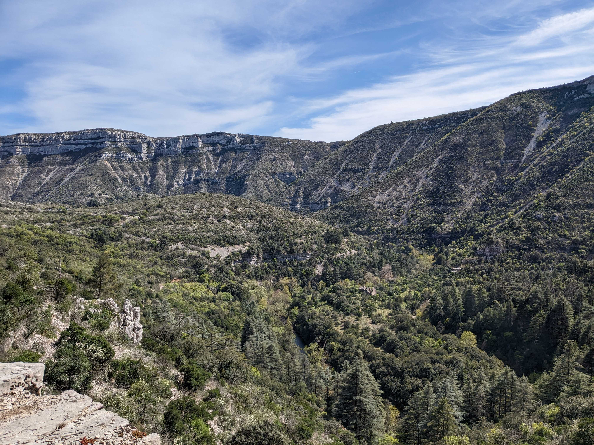

```{r setup, include=FALSE}
knitr::opts_chunk$set(echo = FALSE)
```

```{css}
d-title {
    visibility: hidden;
  }
```

<style>
body {
text-align: justify;
color: #36454F}
</style>


<span style="color: #93A588;">DRIVERS OF MEDITERRANEAN FORESTS TAXONOMIC, FUNCTIONAL AND PHYLOGENETIC DIVERSITY & ITS EVOLUTION ACROSS FUTURE SCENARIOS (Postdoc - Sept 2023 - August 2026) - with Alejandro Ordonez, Kent Olsen and Jens-Christian Svenning. </span>


I am beginning a Postdoc at the [ECONOVO Center](https://bio.au.dk/forskning/forskningscentre/econovo)
at [Aarhus University](https://international.au.dk/) (Denmark). 
The first goal of my postdoc is to **explore the drivers of diversity in Euro-Mediterranean forests**, by leading a **multifaceted approach** considering the taxonomic, functional and phylogenetic facets of diversity and five key taxa of Mediterranean forests. These drivers consider past climate stability, habitat characteristics, disturbances and past and present direct human impact. 
Then, once the drivers have been highlighted, we will be able to assess the **expected trajectories of each diversity facet in a near future** (2100) and study how it will **impact carbon sequestration**. 
Finally, we will focus on **diversity hotspots and protected areas** to understand how current hotspots and protected areas roles will change in the near future, by looking at their **role in safeguarding functionally and phylogenetically vulnerable species and ecosystem processes**. We plan to build a website to provide stakeholders with results they could use. My work is part of the INTEGRADIV project  


This work is part of the [INTEGRADIV](https://www.integradiv-biodiversa.org/)
Biodiversa project whose final role is to **provide guidelines on how taxonomic, functional and phylogenetic facets of biodiversity could be encapsulated in realistic conservation plans** - you can find a video explaining the global aim of the project [here](https://youtu.be/9XBM03hzWxw).

For a **global summary of the first parts of my project during this postdoc**,
you can have a look at the poster I presented at the IBS 2024 [**here**](pdfs/IBS_Poster_CMagneville_versfinale.pdf).


```{r, echo=FALSE, layout="l-body-outset", fig.cap=""}

```


<span style="color: #93A588;">FUNCTIONAL DIVERSITY OF FISHES IN COASTAL MARINE ECOSYSTEMS AND ITS TEMPORAL VARIABILITY (PhD thesis - 2019 - 2023) - with Sébastien Villéger and Thomas Claverie. </span>

I did my PhD at the [MARBEC lab](https://umr-marbec.fr/en/) at the 
[University of Montpellier](https://www.umontpellier.fr/en/) (France). I 
developped new tools to **estimate the temporal variability of fishes diversity and functional roles** based on **long-duration cameras approaches**. Using these tools, I studied **how functional roles varied at within-day and between-day scales** in temperate and tropical coastal ecosystems. Then, I assessed how these temporal variations at short temporal scale can affect our **perception of Protected Marine Areas effect**. 

I have found that within-day and between-day variability in species 
functional roles is high and that functional processes (such as herbivory or corallivory) are mainly realized during intense activity events. Thus measuring functional processes on short temporal scales can bias their estimation.

My PhD was filled with different experiences. **Methodological work** through the development of long-duration underwater cameras, the construction of a metric to better assess mobile species abundance on videos & the lead of the creation of a R package to compute and plot functional diversity indices with a team of researchers. I then applied these tools to **collect and analyse data**, trying to enhance our understanding of within-day and between-day variability in species 
functional roles, through **fieldwork** (Mediterranean Sea and Indian Ocean) and **reproducible analyses in R**. I also had the opportunity to work with an incredible team of **students**, who assisted me in these advancements and with whom I enjoyed sharing skills. This exchange of knowledge and ideas - which goes both ways, is essential to my work, that's why I also taught **courses in statistics and functional ecology**.

```{r, echo=FALSE, layout="l-body-outset", fig.cap=""}
knitr::include_graphics("images/cam.JPG")
```
